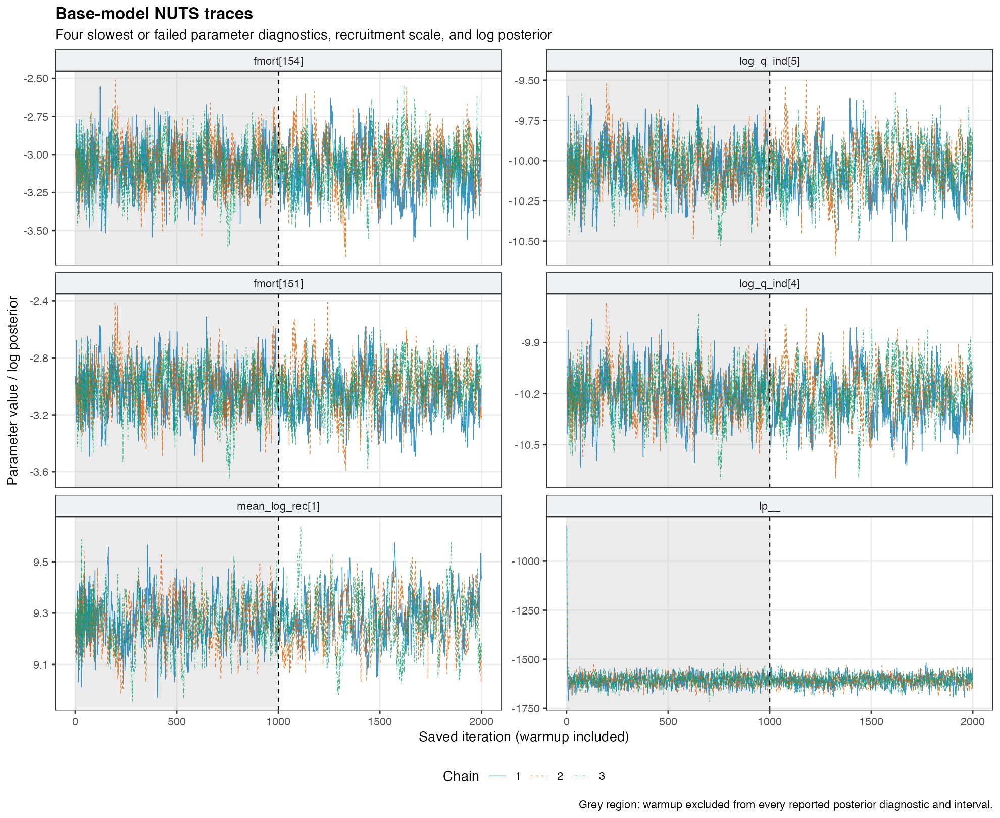
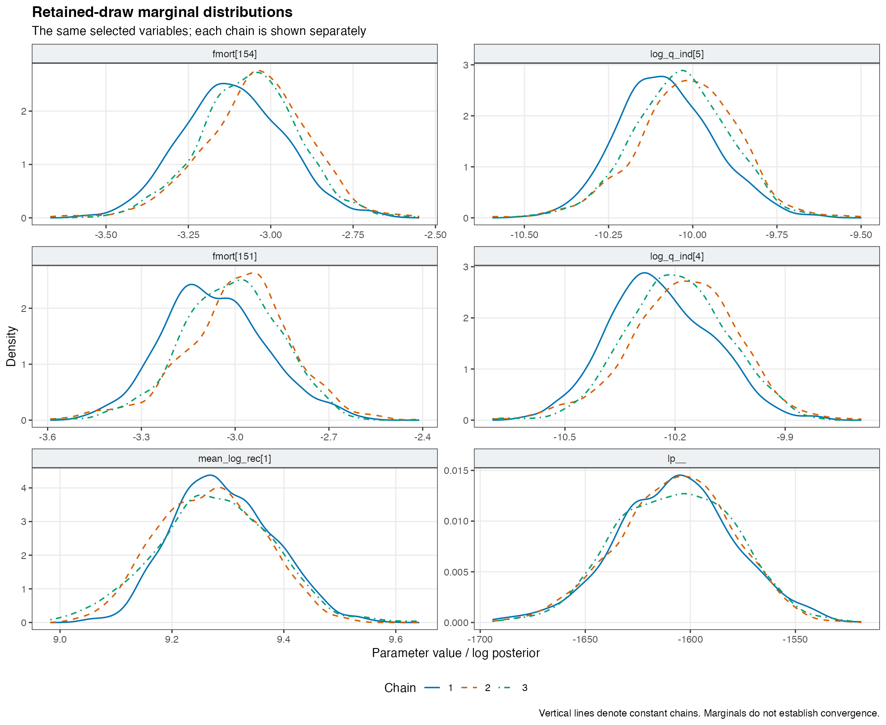
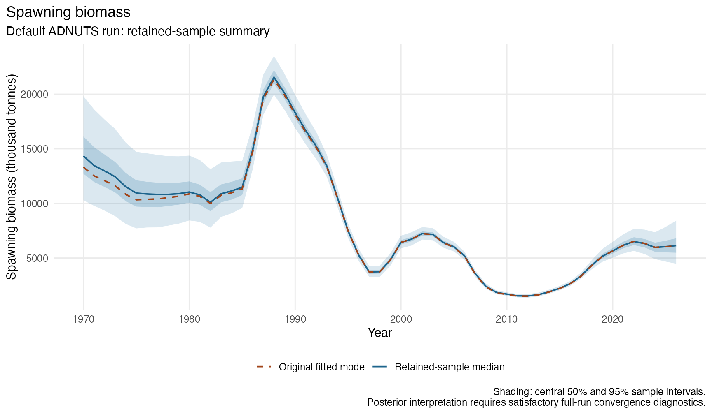
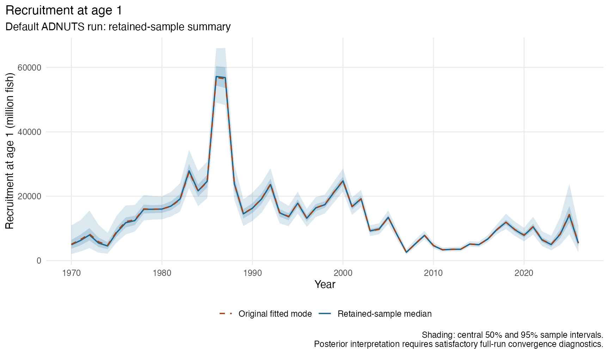
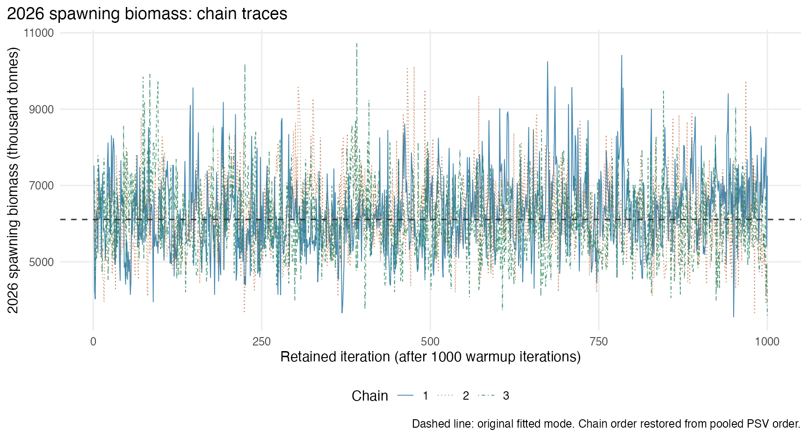
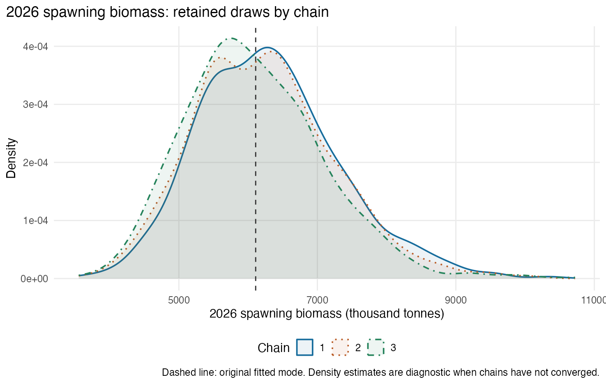
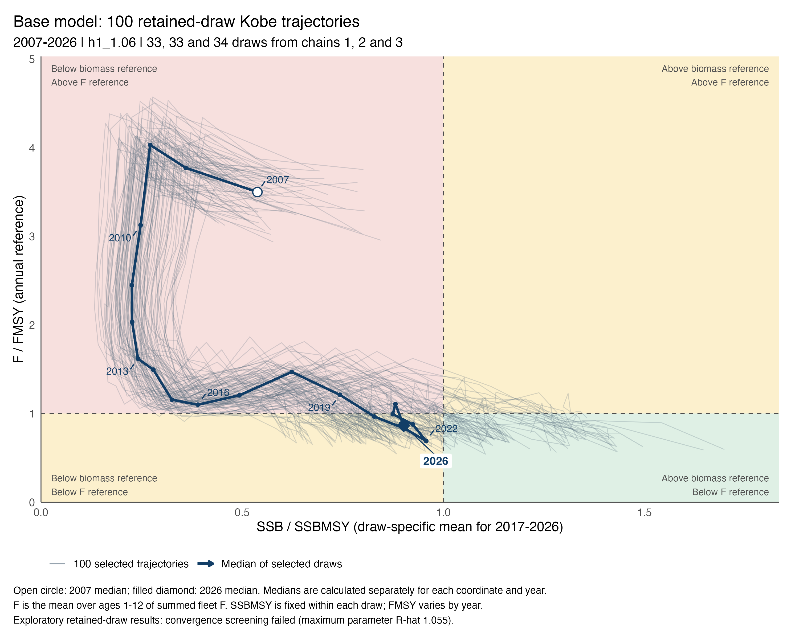

[Back to the jack mackerel wiki](../../assessments.html) · [Current SC14 assessment](../../assessment/SC14.html)

```{r}
#| label: read-saved-results
library(jsonlite)
library(knitr)
manifest <- fromJSON("run-manifest.json", simplifyVector = TRUE)
diag <- fromJSON("diagnostic-summary.json", simplifyVector = TRUE)
parameters <- read.csv("parameter-summary.csv", check.names = FALSE)
derived <- read.csv("derived-summary.csv", check.names = FALSE)
derived_diag <- fromJSON("derived-status.json", simplifyVector = TRUE)
terminal <- derived[derived$year == 2026 & derived$type %in% c("SSB", "Recruits"), ]
chains <- read.csv("chain-diagnostics.csv", check.names = FALSE)
fmt <- function(x, digits=2) ifelse(is.finite(x), formatC(x, format="f", digits=digits, big.mark=","), "Not available")
parameter_rows <- parameters[parameters$is_parameter, ]
passes <- identical(diag$screening_status, "passes reported screening") && isTRUE(derived_diag$selected_quantities_pass_rhat_ess_screen)
stopifnot(identical(as.integer(unlist(manifest$actual_dimensions)), c(2000L,3L,1594L)),
          diag$dimensions$retained_total == 3000L,
          diag$dimensions$active_parameters == 1593L,
          nrow(parameter_rows) == 1593L,
          sum(chains$retained_draws) == 3000L)
```

## What the run shows

The default ADNUTS run sampled **1,593 active parameters** in the single-stock base model **h1_1.06**. Three chains each completed 2,000 iterations; the first 1,000 iterations of each chain were warmup. The summaries below use the remaining **3,000 draws**.

```{r}
#| results: asis
#| label: interpretation-status
if (passes) {
  cat('::: {.callout-note title="Sampling checks passed"}\nThe run passes the parameter and sampler screening checks reported below. Its uncertainty estimates are conditional on this model, its data, its fixed parameter values, and its likelihood and penalty terms. Passing these checks does not establish that the model is correct.\n:::\n')
} else {
  cat('::: {.callout-warning title="The default run needs further sampling checks"}\nThe run completed with no retained divergences or tree-depth-limit events, but some parameters have slow mixing and fail the screening criteria below. The figures and intervals describe these retained draws and should be treated as exploratory. They are not sufficiently validated posterior uncertainty estimates for management advice.\n:::\n')
}
```

The largest finite parameter R-hat is **`r fmt(diag$parameter_checks$maximum_finite_rhat, 3)`**. The smallest finite bulk and tail effective sample sizes are **`r fmt(diag$parameter_checks$minimum_finite_bulk_ess, 0)`** and **`r fmt(diag$parameter_checks$minimum_finite_tail_ess, 0)`**, respectively. There are **`r diag$sampler_checks$divergent_transitions` divergent transitions** and **`r diag$sampler_checks$max_treedepth_hits` maximum-tree-depth events** among 3,000 retained iterations.

The 2026 spawning-biomass sample median is **6.14 million tonnes**, with an exploratory central 95% interval of **4.47–8.43 million tonnes**. Its R-hat is **1.018**, so this quantity also needs further between-chain agreement checks. Recruitment at age 1 has a sample median of **5.38 billion fish**; detailed units, intervals and diagnostics are given below.

This separate working document accompanies the assessment. It does not establish agreed Scientific Committee advice.

## Model and sampler

The [SC14 assessment source](https://github.com/SPRFMO/jjm/blob/main/doc/SC14.qmd) identifies model 1.06 as the final model in the working comparison. This run uses its **single-stock hypothesis**, with data from 1970 through 2026, control file `h1_1.06.ctl`, data file `1.06.dat`, and the saved fitted parameter file. The run retains the working assessment’s 2026 catch projections and other model inputs. The two-stock hypothesis is not included in this run.

The fitted objective was `r sprintf('%.11f', as.numeric(sub('.*Objective function value = ([^ ]+).*', '\\1', manifest$original_parameter_header)))`. An isolated evaluation at the saved parameters reproduced it to within $2\times10^{-9}$. The original fitted maximum gradient component was approximately 0.000167. The preparation used zero optimization iterations; its printed zero gradient is therefore not a new convergence check.

The target is proportional to the exponential of the negative complete ADMB objective over the active parameters and their existing bounds. Existing likelihoods, penalties and priors remain in place; ADMB applies the required Jacobian for its sampling transformations. Parameters fixed in the control file remain fixed, including natural mortality (0.28 per year), steepness (0.65), and recruitment deviation standard deviation (0.6). No additional prior was introduced for this run.

[ADNUTS](https://cole-monnahan-noaa.github.io/adnuts/articles/adnuts.html) provides NUTS sampling for ADMB models. The installed package's `sample_nuts()` defaults were used directly, rather than the repository's differently configured MCMC wrapper.

| Setting | Value |
|:--|:--|
| Model executable | ADMB 13.2, `jjm2` |
| R package | adnuts `r manifest$version` |
| Chains | 3 |
| Iterations per chain | 2,000 total; 1,000 warmup; 1,000 retained |
| Total retained draws | 3,000 |
| Initial mass matrix | Unit diagonal |
| Mass matrix adaptation | Diagonal adaptation during warmup |
| Target acceptance probability | 0.8 |
| Maximum tree depth | 12 |
| Step size | Adapted |
| Thinning | 1 |
| Initialization | Package default: all chains start from the saved fitted mode |
| Chain seeds | `r paste(manifest$package_generated_chain_seeds, collapse=', ')` |
| Sampling wall time | `r fmt(manifest$wall_seconds / 3600, 2)` hours |

The root R seed was 20260910; the package generated the individual chain seeds. Sampler controls were not tuned after seeing this run. The `-fut_sel 3` model argument preserves the assessment's future-selectivity convention; no catch-advice projections are interpreted here. Derived quantities were evaluated from retained draws after sampling, keeping the sampler's default `mceval = FALSE` unchanged.

## Do the chains agree?

R-hat measures agreement between chains, while effective sample size (ESS) accounts for autocorrelation. The screening used here requires rank-normalized split R-hat no greater than 1.01 and bulk and tail ESS of at least 400. The ESS threshold of 400 is the screening choice for this report. These checks follow the definitions in the [Stan diagnostic guidance](https://mc-stan.org/learn-stan/diagnostics-warnings.html); they do not guarantee convergence. All chains start at the same mode under the requested defaults, so these checks provide less protection against undiscovered modes than a suitably dispersed initialization.

```{r}
#| label: tbl-parameter-diagnostics
#| tbl-cap: "Parameter checks across 1,593 active parameters. Log posterior is assessed separately. Failure counts overlap."
p <- diag$parameter_checks
kable(data.frame(Check=c("Pass all parameter screens", "R-hat > 1.01", "Bulk ESS < 400", "Tail ESS < 400", "Undefined diagnostics", "Nonfinite parameter draws", "Constant parameter in any chain"),
                 Parameters=c(p$passing,p$rhat_above_1_01,p$bulk_ess_below_400,p$tail_ess_below_400,p$undefined_diagnostics,p$parameters_with_nonfinite_draws,p$parameters_constant_in_any_chain)))
```

```{r}
#| label: tbl-chain-diagnostics
#| tbl-cap: "Sampler checks use only the 1,000 retained iterations in each chain."
x <- chains[, c("chain", "retained_draws", "divergent_transitions", "max_treedepth_hits", "ebfmi", "mean_accept_stat", "mean_leapfrog_steps")]
names(x) <- c("Chain", "Retained", "Divergences", "Depth-12 events", "E-BFMI", "Mean acceptance", "Mean leapfrog steps")
kable(x, digits=c(0,0,0,0,3,3,0))
```

Divergences can signal biased exploration. Maximum-tree-depth events indicate that the sampler reached its trajectory-length limit. Energy Bayesian fraction of missing information (E-BFMI) is computed within each retained chain; values below 0.3 are flagged. The full screening requires no divergences, no depth-limit events, finite diagnostics, and E-BFMI of at least 0.3 in every chain.

```{r}
#| label: tbl-slow-parameters
#| tbl-cap: "Ten parameters with the weakest between-chain agreement, followed by lowest bulk ESS. Native ADMB parameter scales are retained."
o <- order(parameter_rows$passes_parameter_checks,
           -ifelse(is.finite(parameter_rows$rhat), parameter_rows$rhat, Inf),
           ifelse(is.finite(parameter_rows$ess_bulk), parameter_rows$ess_bulk, -Inf))
x <- head(parameter_rows[o,c("variable","rhat","ess_bulk","ess_tail","mcse_mean")],10)
names(x) <- c("Parameter","R-hat","Bulk ESS","Tail ESS","MCSE of mean")
kable(x, digits=c(0,3,0,0,4), row.names=FALSE)
```

{#fig-traces fig-alt="Separate chain traces for selected model parameters and log posterior. A shaded region marks the first 1000 warmup iterations, which are excluded from all reported summaries."}

{#fig-marginals fig-alt="Chain-specific density curves for six selected quantities using only retained draws. Different line types and colors identify the three chains."}

## Biomass and recruitment uncertainty

These summaries use all 3,000 retained draws, with chain membership preserved for diagnostics. Intervals are the equal-tailed 2.5th and 97.5th percentiles. When the screening above fails, they remain descriptive intervals for the sampled draws and should not be interpreted as validated credible intervals.

```{r}
#| label: tbl-terminal-results
#| tbl-cap: "2026 summaries from all 3,000 retained draws. Intervals are exploratory because the full-model sampling checks fail."
x <- terminal[match(c("SSB", "Recruits"), terminal$type), ]
kable(data.frame(Quantity=x$quantity, Units=x$units,
                 "Fitted mode"=fmt(x$mode, 0),
                 "Sample median"=fmt(x$median, 0),
                 "2.5th–97.5th percentiles"=paste0(fmt(x$lower95,0), "–", fmt(x$upper95,0)),
                 "R-hat"=fmt(x$rhat,3), "Bulk ESS"=fmt(x$ess_bulk,0),
                 "Tail ESS"=fmt(x$ess_tail,0), check.names=FALSE))
```

The original fitted values are 6,108.87 thousand tonnes of spawning biomass and 5,559.86 million recruits at age 1 in 2026. The mode curves below were regenerated at the saved fitted parameters and checked against the original objective. The central 50% band shows the interquartile range; the wider band contains the central 95% of retained values.

The derived-quantity screen flags **`r derived_diag$flagged_quantity_years` of `r derived_diag$assessed_quantity_years` quantity-year combinations** (spawning biomass and recruitment over 1970–2026). Its maximum R-hat is `r fmt(derived_diag$max_rhat, 3)`, and minimum bulk/tail ESS are `r fmt(derived_diag$min_ess_bulk, 0)`/`r fmt(derived_diag$min_ess_tail, 0)`. Individual biomass or recruitment diagnostics do not override failures elsewhere in the model.

{#fig-ssb fig-alt="Historical spawning biomass in thousand tonnes, with sample median and shaded central 50 and 95 percent intervals. A dashed line marks the original fitted mode; the intervals are exploratory given incomplete chain agreement."}

{#fig-recruitment fig-alt="Age-one recruitment in million fish by year, with retained-sample median, central 50 and 95 percent intervals, and dashed fitted-mode estimates."}

{#fig-terminal-trace fig-alt="2026 spawning biomass from each of the three chains across 1000 retained iterations, with a horizontal fitted-mode reference. Chain line styles and colors allow assessment of overlap and drift."}

{#fig-terminal-density fig-alt="Three separate density curves for retained 2026 spawning-biomass draws, with a fitted-mode vertical reference, allowing visual comparison of chain locations and spreads."}


## 100 Kobe trajectories, 2007–2026 {#kobe-trajectories}

The Kobe display follows **100 retained draws through the last 20 model years, 2007–2026**. Draws were sampled without replacement using seed 20260910: 33 from chain 1, 33 from chain 2 and 34 from chain 3. Each trajectory follows the same parameter draw across all 20 years. These are historical fitted trajectories conditional on the base model; the full-run mixing limitations also apply here.

[Explore the interactive Kobe plot](kobe-100-trajectories-2007-2026.html) to select a trajectory and inspect its year-specific values. Download [compact Kobe-format data](kobe-format.csv) (`iter`, `year`, `stock`, `harvest`) or [all quantities and draw identities](kobe-trajectories-100-draws-2007-2026.csv). Each CSV has **2,000 rows: 100 draws × 20 years**.

The horizontal coordinate is spawning biomass divided by the draw's mean annual MSY spawning biomass over **2017–2026**, following the assessment's fixed-biomass-reference convention. The vertical coordinate is fishing mortality divided by the **matching annual FMSY**. Fishing mortality is the unweighted mean across all 12 model ages after summing the four fleets:

$$
\mathrm{stock}_{d,y}=\frac{SSB_{d,y}}{\operatorname{mean}_{t=2017}^{2026}(SSBMSY_{d,t})},
\qquad
\mathrm{harvest}_{d,y}=\frac{\frac{1}{12}\sum_{f=1}^{4}\sum_{a=1}^{12}F_{d,f,y,a}}{FMSY_{d,y}}.
$$

Both coordinates are dimensionless. Reference lines at one mark each denominator. The thick curve joins the coordinate-wise medians of the 100 selected draws for each year; it is a visual summary and need not be a possible model trajectory itself.

{#fig-kobe fig-alt="Kobe plot of 100 retained posterior trajectories over 2007 to 2026. Horizontal axis is spawning biomass relative to each draw's mean 2017 to 2026 MSY biomass; vertical axis is fishing mortality relative to annual FMSY. The median moves from approximately 0.54 and 3.50 in 2007 to 0.90 and 0.86 in 2026. Reference lines divide the plane at one; these are exploratory results because full-run chain screening failed."}

Annual reference points come from the frozen model's existing annual MSY routine. The original evaluation omitted annual FMSY, so a reporting-only copy emitted that quantity and the native F/FMSY check for the selected draws. The added output leaves their spawning biomass, fishing mortality and annual MSY biomass identical to the original evaluation. All annual reference points are positive and none reaches the routine's fishing-mortality grid limits. See the [Kobe methods and data dictionary](kobe-README.md), [selection manifest](selection-manifest.csv), [validation record](kobe-status.json), and [supplementary reproduction files](kobe-reproducibility.zip).

## Interpretation and next steps

The chain-specific marginal plots show a shift in chain 1 for several of the slowest fishing-mortality and survey-catchability parameters. This agrees with the elevated R-hat and low ESS. Increasing the retained run length and checking suitably dispersed starting points are reasonable next checks; either would be a separately labelled follow-up run. The current analysis preserves the requested defaults.

## What uncertainty is covered?

MCMC explores parameter uncertainty conditional on this single-stock model. It does not measure uncertainty from alternative stock hypotheses, omitted processes, different data treatment, or parameters fixed by the control file. The defaults initialize every chain at the same mode. A run that needs further work should be followed by a separately labelled analysis with justified changes to initialization, run length or sampler controls.

The model's native `Fbar` MCMC field is not presented as stock-wide fishing mortality because its reporting code reads a fishery-specific parameter. Likewise, its native depletion fields have definitions that differ from spawning biomass relative to an unfished reference. Neither field is silently substituted for a stock-status measure.

## Files and reproducibility

- [Editable Quarto source](base-model-adnuts.qmd)
- [Recorded run settings](run-manifest.json) and [sampling diagnostic summary](diagnostic-summary.json)
- [All parameter summaries](parameter-summary.csv) and [chain diagnostics](chain-diagnostics.csv)
- [Derived quantity summaries](derived-summary.csv) and [source notes](source-notes.md)
- [Kobe data in R format](kobe-trajectories.rds), [vector figure](kobe-100-trajectories-2007-2026.svg), and [trajectory extraction script](build-kobe-trajectories.R)
- [Software environment](session-info.txt) and [source/output checksums](release-manifest.json)
- [Reproduction instructions](reproduction-README.md) and [reproducibility files](reproducibility.zip), including the exact model source, control, data, saved parameter input, and analysis scripts

The raw fit and full ADMB evaluation output are retained in the local run archive. Their checksums identify the draws used here. Report rendering reads saved summaries and figures; it does not rerun MCMC.

## Validation record

| Check | Outcome | Evidence |
|:--|:--|:--|
| Base-model identity and inputs | Pass | Frozen file hashes; original and prepared objective agree within 2 × 10⁻⁹ |
| Requested sampler defaults | Pass | Recorded package formals, resolved controls and all three executed commands |
| Sampling completion and draw order | Pass | 2,000 × 3 iterations; all 4,779,000 pooled parameter values match the retained fit bit for bit |
| Numerical sampler diagnostics | Pass | No retained divergences or depth saturation; E-BFMI ≥0.984 |
| Parameter mixing and precision | Fail | 366/1,593 active parameters fail one or more reported screens |
| Native derived-output completeness | Pass | All 3,000 draws and 57 years verified; all 20 native output types inventoried |
| Kobe draw selection and coordinates | Pass | 100 distinct retained draws; 20 years each; unchanged native quantities and matching annual reference points |
| Reported results | Pass | Tables and figures read the saved, checked CSVs; independent parameter diagnostic calculation agrees |
| HTML, navigation, figure descriptions and file links | Pass | Rendered artifact, figure review and scoped local-link validation recorded in the release checks |
| Manual screen-reader review | Not tested | Not performed |

These checks describe this analysis and its deliverables; they are not an accessibility certification.
