[First CMP screening working paper](../cmp-screening-2026/cmp-screening-working-paper.html) · [Back to the jack mackerel wiki](../../mse.html) · [All CMPs and fixed catch: best-relative scorecard](scorecard-all.html) · [Selected CMPs and fixed catch: best-relative scorecard](scorecard-shortlist.html)

::: {.callout-note title="Purpose"}
This second working paper uses the same format and saved 500-simulation results as the first, but focuses on **MP29 (HS+20), MP45 (HSsym), and MP43 (HS−20)**. All three are retained as a discussion set for examining differences among the hockey-stick rules. Model settings, tuning, time windows and the illustrative screening tolerances are unchanged. The advice-reduction statistic is the probability of occurrence over all 25 projection years and 500 iterations. The first working paper remains available separately.
:::

## Findings for discussion

The three hockey-stick CMPs have similar reference median catch and IACC, but differ in low-catch risk, biomass risk and the probability of advice reductions greater than 19%. **MP29 and MP45 have zero occurrences of those advice reductions in the reference runs; MP43 has 761 occurrences in 12,500 comparisons (6.09%).** MP45 has the lowest median IACC of these three, and MP43 has the highest median catch. Those catch and IACC differences are small relative to the inherited screening tolerances.

Under the same five-indicator tolerances as the first paper, MP29 compares favourably with both alternatives, and MP45 compares favourably with MP43. These are tolerance-based comparisons, not strict dominance: small disadvantages in other indicators remain visible in the table. All three remain in this comparison. Robustness performance and agreed biological requirements remain separate considerations.

## Data, periods and indicator definitions

The source results cover eight candidate management procedures (CMPs), each with 500 simulations; this document focuses on three. The same runs were evaluated under the reference operating model (OM) and nine alternative OMs used to test performance under different assumptions (robustness tests). Two-stock OMs are shown by biological component; their catches and biomasses are reported separately. Advice reductions use all annual advice comparisons across all iterations (advice years **2025–2049**, applied **2026–2050**). Other performance calculations use **2041–2050**, except the inherited mean-catch-reduction column available as an optional scorecard indicator, which uses **2026–2050**. The worm plots span **2025–2050**.

For catch, interannual catch change (IACC), and SSB/SSBMSY, first calculate each simulation's mean over 2041–2050. Trade-off points then show the median across 500 simulations; horizontal and vertical bars show the 25th–75th percentiles. The bars contain the middle half of simulation-specific values. Uncertainty in the estimated median would require a separate calculation. IACC is the absolute percentage change from the previous year's realized catch. The 2041 change therefore uses catch in 2040. The biomass ratio in the trade-off plots uses the stored **static SSBMSY** denominator; it is distinct from the dynamic-B0 risk indicator.

The low-biomass indicator is the proportion of simulation-years with **SSB <8% of the matching year's dynamic B0**, the previous Blim. Dynamic B0 is the saved projected unfished SSB for the matching simulation. Each year below the threshold counts, including consecutive years. Catch below 270 kt is also a pooled simulation-year frequency.

The **probability of an advice reduction** (`CatchDrop20`) is the proportion of valid annual HCR-advice comparisons with $A_t < 0.81 A_{t-1}$, pooled over all years and 500 iterations. Advice is recorded in 2025–2049 and applied in 2026–2050. The first advice is compared with the saved HCR initial advice, or the constant advice target for fixed catch. This gives 25 comparisons per iteration (12,500 when complete). Exact 19% reductions and increases do not count; 20% reductions count. There are no biomass or near-20% exclusions. Invalid values and nonpositive previous advice are excluded from the denominator and reported in the audit. This uses advice before implementation. Two-stock OMs have advice for the managed Southern stock; the same run-level advice statistic appears in both component views.

[All OM/CMP advice counts and denominators](catchdrop19-advice-summary.csv) · [Annual advice events and checks](candidate_quilt_catch_cut_diagnostics_reference.csv) and [counts and eligible years per simulation](candidate_quilt_event_counts_reference.csv) retain the audit trail.

## Screening the CMP set

Five management-facing indicators are used for this screen: median catch, IACC, low-catch probability, SSB-below-previous-Blim frequency, and the advice-reduction frequency. All eleven indicators remain available in the scorecards; the shortlist uses the five indicators listed here.

The following absolute differences are treated as small for **forming this discussion shortlist**. These thresholds remain open for review. The former tolerance of 0.1 event per ten-year window is expressed as 1 percentage point for the revised advice frequency; its use with the new definition also requires review:

| Indicator | Screening tolerance | Preferred direction |
|---|---:|---|
| Median catch | 40 thousand t | Higher |
| IACC | 0.6 percentage point | Lower |
| Probability of catch below 270 kt | 1 percentage point | Lower |
| Frequency below previous Blim | 1 percentage point | Lower |
| Advice reductions >19% | 1 percentage point | Lower |

A **close alternative** differs from its comparator by no more than every listed tolerance. A CMP is **better within tolerances** when it is no worse beyond any tolerance and better beyond at least one. All six directional comparisons among the three requested CMPs are shown, rather than eliminating a CMP through a chain of comparisons.



MP29 has lower low-catch probability and lower frequency below the previous Blim than MP45; both differences exceed one percentage point. MP29 and MP45 have lower probability of advice reductions greater than 19% than MP43. MP43's modest catch advantage and MP45's lower IACC remain visible, despite being within the inherited tolerances.

### Full reference comparison

The table shows the three requested CMPs. The all-CMP scorecard retains the full eight-CMP comparison as background. C is thousand tonnes; IACC is percent; PC270 and SSBbelow8dB0 are displayed as percentages; CatchDrop20 is displayed as the percentage of all valid consecutive advice comparisons with reductions greater than 19%.



[Screening decisions](screening.csv) · [Screening tolerances](screening-tolerances.csv) · [All eleven indicators for these three CMPs](selected-cmp-quilt-values.csv)

## Scorecards: best 100, others relative to it

Use the [all-CMP scorecard](scorecard-all.html) to review the original set and the [retained-set scorecard](scorecard-shortlist.html) for the retained-set comparison and fixed-catch reference comparison. Both open with **best-relative scaling** and equal weights on the available screening indicators. Use **Choose an OM** to select the reference or any of the nine robustness OMs, then choose a **stock component** for a two-stock OM. Scores are recomputed within the selected OM/component; no OMs or stock components are pooled. Recruitment crash and OM21 appear near the top of the selector.

The fixed-catch benchmark is available in the reference selection only. The supplied fixed-catch results cover the reference OM. The 270 kt whole-stock catch threshold is omitted from two-stock components. When fixed catch is selected, the two vulnerable-biomass indicators are unavailable pending extraction from the supplied run; deselect it to restore those choices. Each scorecard displays only indicators shared by the selected CMPs. The fixed-catch snapshot uses its own stored reference points and reconstructed dynamic B0, preserving its reported tuning convention. Users can change CMPs, indicators, scaling and weights. The overall score helps explore preferences. The paired screening table and raw outcomes should be considered alongside the scores.

For a higher-is-better indicator, the score is $100V_i/\max_j(V_j)$. For a lower-is-better indicator, it is $100\min_j(V_j)/V_i$. The best value therefore scores 100. Scores are recalculated for the selected CMP set, so each selection has its own reference for comparison.

**Zero-best exception:** when the best value for a lower-is-better indicator is zero, zero-valued CMPs score 100 and positive-valued CMPs score zero. This rule is necessary because the ordinary ratio cannot distinguish positive values when its numerator is zero. MP29 and MP45 have zero reference advice-reduction probability, while MP43 has 6.09%. Thus MP43 scores zero for this indicator under best-relative scaling when either zero-valued comparator is selected. Inspect raw probabilities and range scaling before assigning weight. Related stock or stability indicators can overlap even when given equal weights.

The [existing general best-relative explorer](https://sprfmo.github.io/jmMSE26/application/scorecard-best-relative.html) and [original range-scaled explorer](https://sprfmo.github.io/jmMSE26/application/scorecard.html) provide the broader application context. The two companion scorecards above embed this paper's exact data snapshot for reproducibility.

## Reference-OM trade-offs after screening

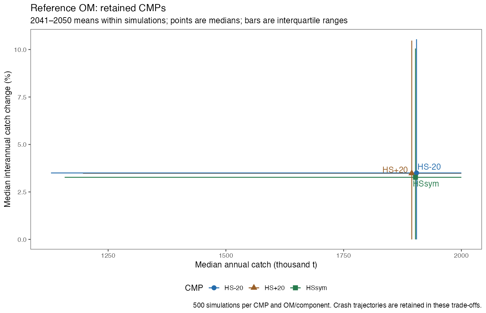{#fig-reference-stability fig-alt="Three selected CMPs plotted with median catch on the horizontal axis and median interannual catch change on the vertical axis. Both directions have interquartile bars; colours and point shapes distinguish CMPs."}

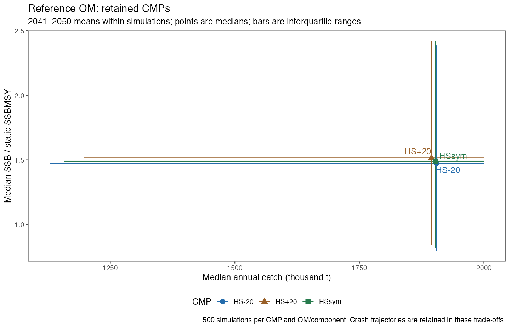{#fig-reference-biomass fig-alt="Median catch versus median SSB divided by static SSBMSY for HS plus 20, HS symmetric and HS minus 20, with horizontal and vertical interquartile ranges."}

The reference plots expose the cost of concentrating on one outcome. The preferred CMP can change with the priority given to catch stability, catch level or low-biomass risk. Simulation ranges can overlap while differences between rules remain within individual simulations. The shortlist should be revisited if a different time horizon, screening tolerance or biological constraint is agreed.

## Focused robustness: recruitment crash and OM21

The requested comparison keeps **MP29 (HS+20), MP45 (HSsym), and MP43 (HS−20)** and focuses on
**om11_2 (h1_0.16_lowrec, recruitment crash)** and **om21 (h2_0.16, two stocks)**.
The existing om11_2 uses the saved `collf` recruitment-deviation scenario; its
saved results and tuning are retained. OM21 retains separate North and
Southern components. The reference OM is included alongside them for orientation.

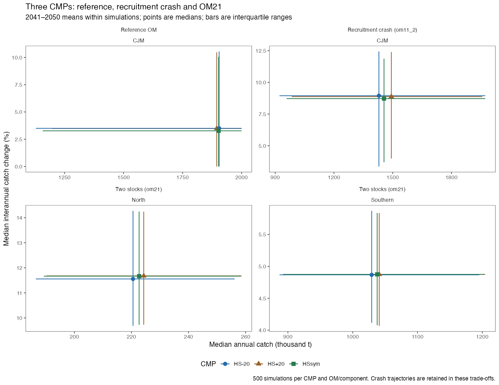{#fig-focus-iacc fig-alt="Four panels compare HS plus 20, HS symmetric and HS minus 20. Catch is horizontal, interannual catch change vertical, with medians and interquartile ranges over 500 simulations."}

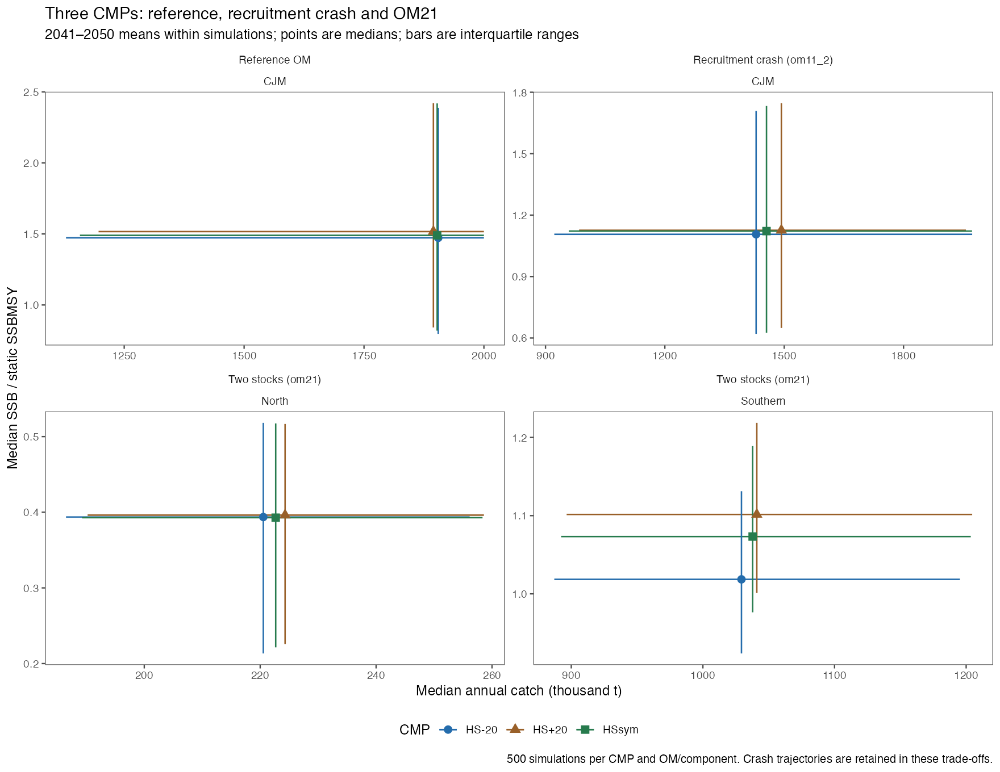{#fig-focus-ssb fig-alt="Four panels display median catch versus median SSB divided by static SSBMSY for the reference stock, recruitment-crash stock, and the two OM21 components. Both axes have interquartile bars."}

The following risk table instead uses **dynamic BMSY** for green status and
**8% dynamic B0** for the previous Blim, separately for each biological
component. These are proportions of the 5,000 simulation-years per CMP and
component over 2041–2050. A probability that both stocks meet the target together would require a
separate calculation.



Under recruitment crash, MP29 has the highest dynamic-green probability of these three (45.2%), while MP43 has the lowest below-previous-Blim frequency (9.6%). MP45 lies between them for green probability (44.6%) but has a slightly higher below-Blim frequency (10.3%). These indicators therefore give different views of performance.

In OM21, Southern green probability is 61.3% for MP29, 55.9% for MP45 and 43.7% for MP43. Northern green probability is zero under all three, with below-Blim frequencies of 14.4%, 14.8% and 15.5%, respectively. Judging performance for the two-stock system requires both stocks; high Southern performance does not establish acceptable Northern outcomes.

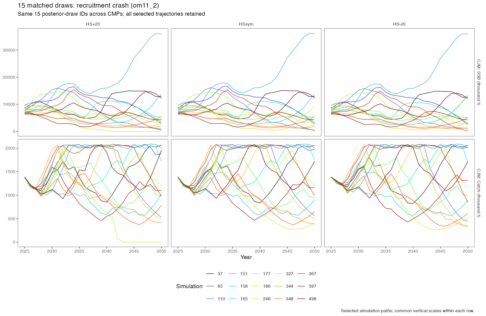{#fig-worm-rec-crash fig-alt="Six panels show the same 15 posterior-draw IDs for SSB and catch under HS plus 20, HS symmetric and HS minus 20 in the recruitment-crash OM. Low trajectories remain included."}

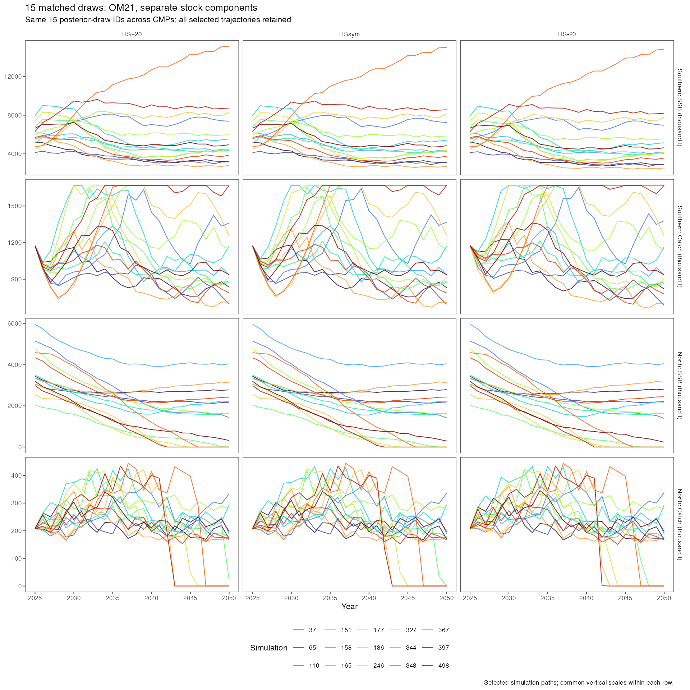{#fig-worm-om21 fig-alt="Twelve panels separate Northern and Southern SSB and catch for the three CMPs. The same 15 draw IDs are retained across CMPs; scales are shared within each row."}

[Focused trade-off data](focused-robustness-tradeoffs.csv) ·
[Dynamic risk results](focused-robustness-risk.csv) ·
[Robustness worm trajectories](focused-robustness-worms.csv)

Full robustness plots and interpretation across all nine OMs

The alternative OMs provide a separate check of the reference shortlist. The following plots keep each OM and stock component separate. Panel scales vary to make within-panel comparisons legible; compare numerical axes before comparing distances across panels. No probabilities or weights have been assigned to the OMs.

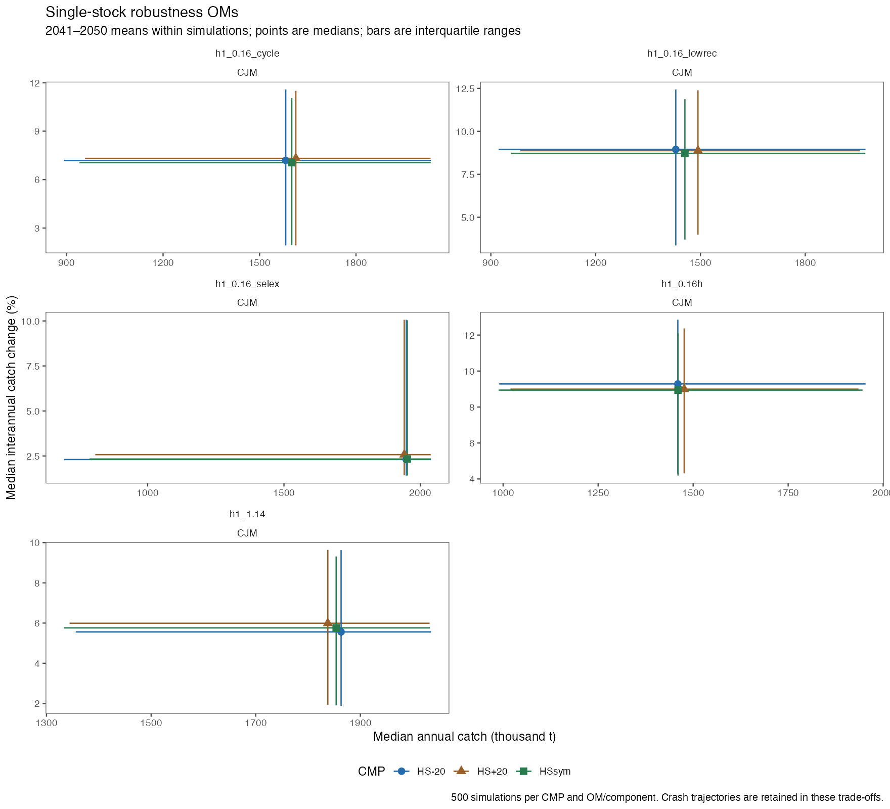{#fig-single-stability fig-alt="Five panels show retained CMP catch and interannual catch-change medians and interquartile ranges for alternative selectivity, low recruitment, cyclic recruitment, higher steepness and the alternative assessment model."}

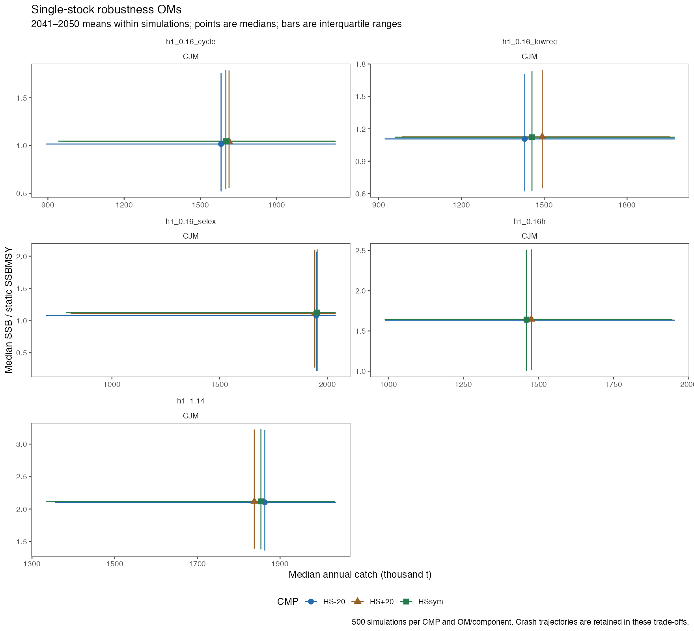{#fig-single-biomass fig-alt="Five separate single-stock robustness panels compare catch and static-reference SSB ratios for the selected CMPs, with interquartile bars on both axes."}

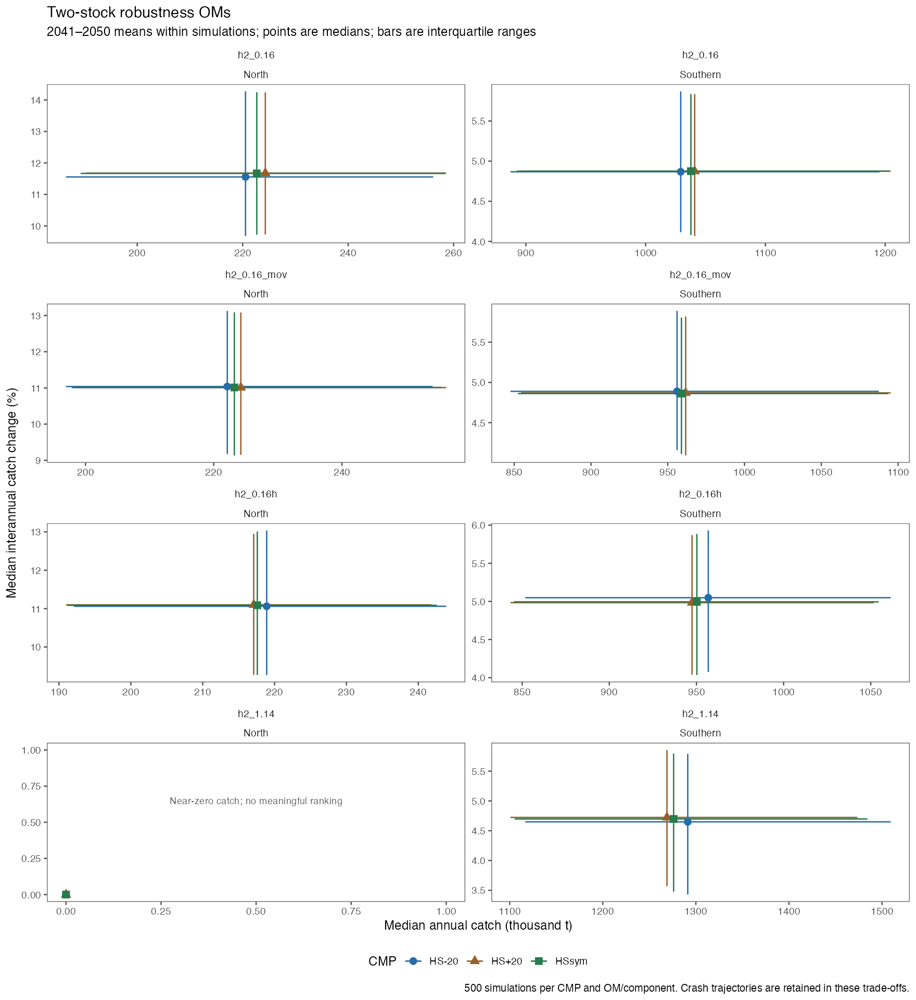{#fig-two-stability fig-alt="Eight panels separate the two biological components of four two-stock OMs. Each displays retained CMP catch and variability with interquartile ranges."}

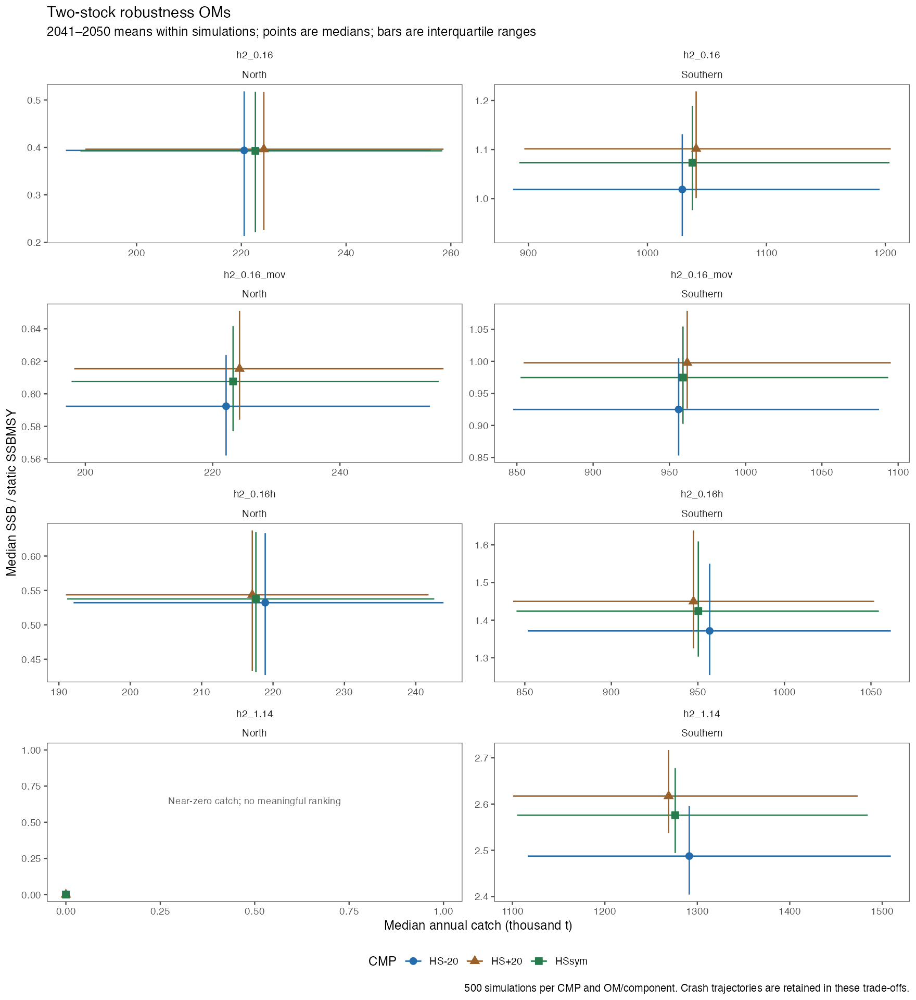{#fig-two-biomass fig-alt="Eight stock-component panels compare catch and static-reference spawning-biomass ratios under two-stock, movement, steepness and assessment-model alternatives."}

The panels show whether reference-OM differences persist under alternative assumptions, without pooling OMs or stock components. The Northern component of h2_1.14 has essentially zero catch under all three CMPs; that panel is labelled as having too little catch to support a useful numerical ranking. Raw values remain in the downloadable data.

All eight CMPs' OM-specific summaries are retained in the [complete trade-off data](tradeoff-summary-all-cmps.csv). An omitted CMP should be reinstated if the working group identifies a useful advantage under an alternative OM. The preferred CMP across OMs remains open. The requested three-CMP set is evaluated using the inherited practical thresholds; formal statistical testing would be a separate analysis.

## Fifteen matched simulation paths {#fifteen-matched-simulation-worms}

The 15 iteration IDs are reused from the earlier paired reference figure: **37, 65, 110, 151, 158, 165, 177, 186, 246, 327, 344, 348, 367, 397 and 498**. The same IDs and colours are used in all six panels. The original selection is retained, including poor outcomes. Matching IDs align the underlying parameter draws. Random observation errors can still differ between CMP runs that use different seeds.

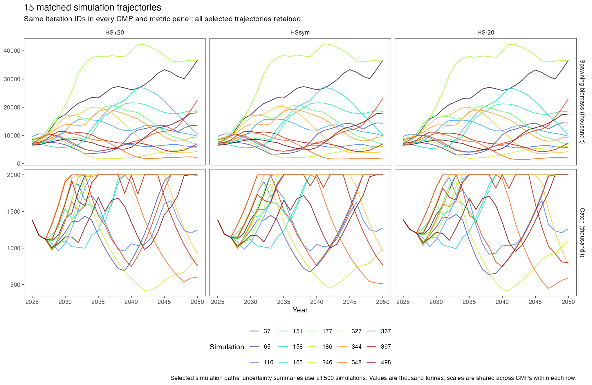{#fig-worms fig-alt="Six panels show SSB above and catch below for HS plus 20, HS symmetric and HS minus 20. Fifteen individually coloured simulations are matched across all panels; all trajectories, including low outcomes, are retained."}

These plots show the timing and persistence of changes in 15 of the 500 simulations. Outcome probabilities and uncertainty ranges are calculated from the full set. The full-distribution trade-off summaries and low-biomass frequencies remain the basis for comparing typical performance and risk.

[Iteration IDs](worm-iterations.csv) · [SSB and catch trajectories](worm-trajectories.csv)

## Fixed-catch reference comparison {#fixed-catch-reference-benchmark}

The supplied `tunfixc.rds` is an `FLmse` reference-OM result with **500
simulations**, projection years 2025–2050, and `fixedC.hcr` advice of **1,525
thousand tonnes per year**. It is intended to be tuned to the same 60% dynamic
green objective as the other CMPs. Reconstructing its unfished trajectory with
the repository's zero-catch projection, using the supplied run's own initial
state, gives **P(green) = 60.3% over 2041–2050**. This is consistent with the
reported target. This checks the achieved probability. Reviewing the full tuning history
would require the original tuning record and stopping tolerance, which are
absent from the supplied result. Using static BMSY instead gives 57.8%.



Advice is fixed while realized catch varies. Recorded
implementation-adjusted targets vary from about **1,517 to 1,593 thousand
tonnes**; the mean catch within each simulation therefore varies, as do
realized annual changes. The supplied run includes implementation adjustments,
whereas the current reference tuning call for the three CMPs omitted
the random implementation-error model.

The initial numbers-at-age, mortality, maturity, weights and stock–recruit
parameters match the current reference OM. However, the projected recruitment
deviations and stored MSY reference points differ. For example,
median stored FMSY is about **0.298** in the fixed-catch run and **0.334** in
the current reference bundle. The scorecard includes it as a reference
comparison using its own saved reference points. Isolating the effect of
the harvest control rule (HCR) would require a rerun with matching
recruitment, reference points and implementation assumptions.

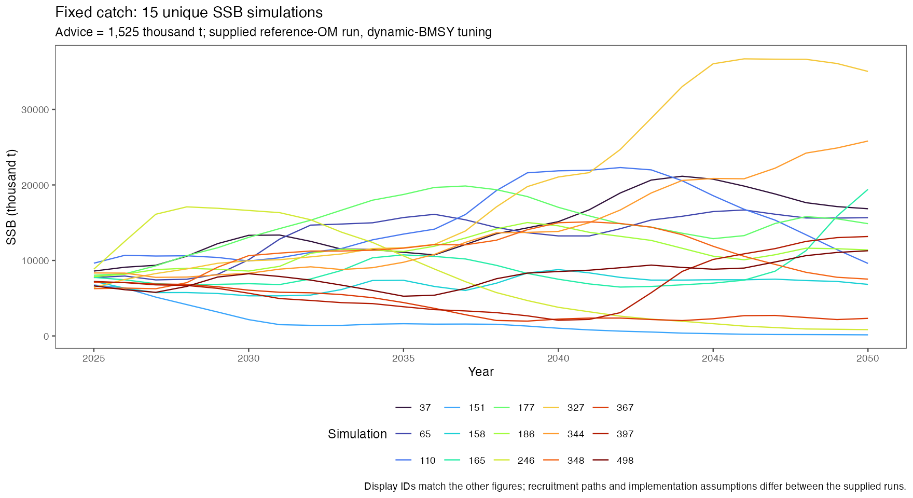{#fig-worm-fixed fig-alt="One panel shows SSB for 15 distinct simulations of the supplied fixed-catch reference run from 2025 to 2050, including trajectories that fall sharply."}

The same 15 display IDs help orient the reader; recruitment paths differ
from those in the current CMP runs. The available fixed-catch results cover
the reference OM, so this option appears only in the reference scorecard.

[Fixed-catch summary](fixed-catch-summary.csv) ·
[Stored reference-point comparison](fixed-catch-reference-point-check.csv) ·
[Recorded implementation targets](fixed-catch-implementation-targets.csv) ·
[Input files and reconstruction record](robustness-fixedcatch-provenance.txt)

## Decisions this paper can support

This second document supports discussion of MP29, MP45 and MP43. The [first paper’s draft decision guide](../cmp-screening-2026/cmp-decision-guide.html) remains associated with its original discussion set and does not constitute advice selecting these three CMPs.

1. Review the explicit screening tolerances and decide whether the three-CMP presentation set is sufficient for the next discussion.
2. Set biological acceptability criteria separately from best-relative scoring; a relatively high score can coexist with unacceptable risk.
3. Examine robustness panels and the full-set data before treating an omitted CMP as dispensable.
4. Agree which indicators and weights represent the objectives, paying particular attention to zero-best risk indicators and overlapping measures.
5. Retain projection-failure diagnostics and advice-versus-realized-catch checks as outstanding validation work. The advice statistic measures decisions before implementation; failed projections and their effects on realized-catch indicators still require investigation.

## Source files and checks {#reproducibility-and-scope-of-validation}

The base script `R/build_cmp_screening_paper.R` reads the saved reference and robustness performance tables from `output/candidate-performance-500/`, and the reference runs from `jmMSE-500-refine/model/tune/refine_500_from_100/runs.rds`. The saved CMP simulations are unchanged. The fixed-catch files are reused unchanged from the first paper, where its dynamic reference points were checked against a reconstructed zero-catch counterfactual. The current quilt supplies the advice-reduction probability and dynamic-B0 risk values. The extension `R/extend_cmp_paper_robustness_fixedcatch.R` reads the two robustness checkpoints for the selected CMPs. For this second paper, fixed-catch reconstruction is skipped and its previously checked files are reused. `R/build_hs_screening_tables.R` calculates the six direct paired screening comparisons. `R/build_cmp_om_scorecards.R`, `R/add_fixedcatch_scorecard.R` and `R/configure_cmp_scorecard_oms.py` rebuild the OM-aware scorecard snapshots and interfaces. Input checksums and the R session are recorded in [input and software record](provenance.txt). This paper's [editable Quarto source](cmp-screening-working-paper.qmd) and companion data permit revision without editing the displayed figures manually.

The reproducible command is provided in [second-paper build instructions](BUILD.md).

Validation checks require 500 iterations for every OM/CMP/component summary, complete 15-by-26-year worm panels, common worm IDs, documented mass units, and direct numerical confirmation of every screening comparison. The HTML uses semantic headings and tables, numerical data alternatives, captions, and figure descriptions. Screen-reader testing and formal accessibility review remain outstanding. This paper analyses saved outputs using the existing model dynamics and reference-point conventions. Verification of the assessment and projection calculations remains separate work.

## Related working-group material

- [Full SC14 MSE working report](https://sprfmo.github.io/jmMSE26/evidence/sc14-mse-report.html): candidate definitions, conditioning, tuning and the broader results.
- [Technical paper and remaining work](https://sprfmo.github.io/jmMSE26/sc14/technical-paper.html): implementation and validation context.
- [Jack mackerel research wiki](https://sprfmo.github.io/SC14_JM/mse.html): management questions and links to the meeting papers.
