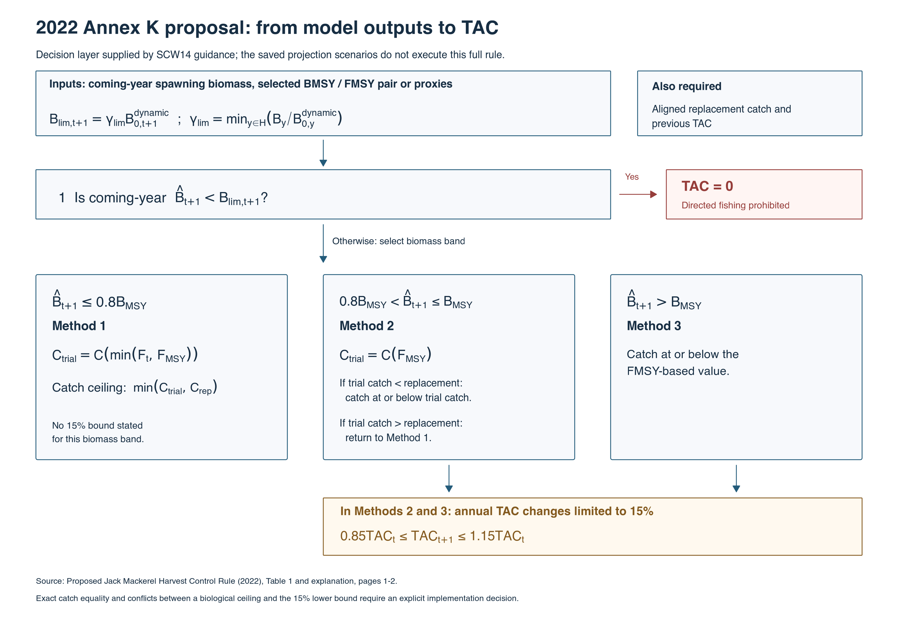

### Applying the supplied 2022 Annex K guidance {#sec-annex-k-guidance}

The supplied Annex K proposal describes the jack mackerel harvest control rule as adjusted during SCW14 [@annexk2022, pp. 1–2]. It adds a **catch-decision step** to the reference-point and projection calculations above. The document records a proposal; its application in 2026 requires the agreed management record and an explicit reference-point convention.

{#fig-annex-k-decision width=6.4in fig-alt="Check coming-year spawning biomass against the dynamic limit first: below the limit, TAC is zero. Otherwise use the bands at or below 80% BMSY, above 80% through BMSY, and above BMSY. Trial fishing rates, replacement-catch safeguards and the upper-band 15% TAC constraints are then applied as described in the adjacent table."}

**Decision year and biomass definition.** All biomass quantities in this guidance are spawning biomass. The decision table uses estimated biomass in the **coming year**, $\widehat B_{t+1}$: for a 2026 assessment this is $\widehat B_{2027}$, rather than the terminal estimate $B_{2026}$. The fishing assumption that generates that status forecast must accompany it. The saved scenario-4 forecast is one conditional forecast, rather than a uniquely specified HCR status input.

**Dynamic limit.** The proposal defines the biomass limit from the lowest historical ratio of spawning biomass to its corresponding unfished value:

$$
\gamma_{\mathrm{lim}}=
\min_{y\in\mathcal H}\left(\frac{B_y}{B_{0,y}^{\mathrm{dynamic}}}\right),
\qquad
B_{\mathrm{lim},t+1}=\gamma_{\mathrm{lim}}\,B_{0,t+1}^{\mathrm{dynamic}}.
$$ {#eq-annex-k-limit}

Here $\mathcal H$ is the explicitly identified historical period. Unfished spawning biomass follows the estimated recruitment history, adjusted through the stock–recruit relationship under no fishing. In the saved template these quantities correspond to `Sp_Biom_NoFish` and `Sp_Biom_NoFishRatio`; the future no-fishing calculation supplies the coming-year denominator. This limit differs from both the fixed ten-year B~MSY~ target and the dynamic-B~MSY~ construction. An 8% limit follows only when the selected historical minimum equals 0.08. Calculating a numerical B~lim~ requires a matched historical minimum and coming-year unfished biomass.

**Trial catch and biomass bands.** Write $C_{t+1}(f)$ for the projected catch under trial fishing rate $f$, using a stated fleet allocation, selectivity, recruitment and weight convention. Define

$$
\begin{gathered}
C_1=\min\left\{C_{t+1}\!\left[\min(F_t,F_{\mathrm{MSY}})\right],
C_{t+1}^{\mathrm{replacement}}\right\},\\
C_F=C_{t+1}(F_{\mathrm{MSY}}).
\end{gathered}
$$ {#eq-annex-k-trial}

$C_1$ is the catch ceiling described by method 1. The comparison of $F_t$ with $F_{\mathrm{MSY}}$ requires a common age and selectivity scaling. The annual F~MSY~, scalar F~MSY~ and associated biomass references documented above should therefore retain their definitions when selecting the HCR inputs.

| Coming-year spawning-biomass condition | Catch guidance in the supplied proposal | TAC stability provision |
|---|---|---|
| $\widehat B_{t+1}<B_{\mathrm{lim},t+1}$ | Set TAC to zero; directed jack mackerel fishing prohibited under the proposed rule. | Closure is checked first. |
| Remaining cases with $\widehat B_{t+1}\le0.8B_{\mathrm{MSY}}$ | Trial catch at $\min(F_t,F_{\mathrm{MSY}})$; catch at or below $C_1$. | Stability bound unspecified for this row. |
| $0.8B_{\mathrm{MSY}}<\widehat B_{t+1}\le B_{\mathrm{MSY}}$ | Trial catch at F~MSY~. If $C_F<C^{\mathrm{replacement}}$, catch at or below $C_F$; if $C_F>C^{\mathrm{replacement}}$, return to method 1. | Annual TAC variation limited to 15%. |
| $\widehat B_{t+1}>B_{\mathrm{MSY}}$ | Catch at or below the value obtained using F~MSY~. | Annual TAC variation limited to 15%. |

: The 2022 proposal's biomass bands and catch calculations, with its first-row limit check given precedence over the overlapping low-biomass row. The source permits an identified BMSY/FMSY proxy. {#tbl-annex-k-rule}

The table places equality at 80% B~MSY~ in the lower band and equality at B~MSY~ in the middle band. The exact trial-catch/replacement-catch equality case remains an implementation choice to resolve. In the upper two bands, the stated annual stability interval is

$$
0.85\,\mathrm{TAC}_t\le\mathrm{TAC}_{t+1}\le1.15\,\mathrm{TAC}_t.
$$ {#eq-annex-k-stability}

That interval and the biological catch ceiling can conflict if the ceiling falls below $0.85\,\mathrm{TAC}_t$. Reconciling these provisions requires an explicit implementation order, which remains unspecified in the proposal. The upper 15% bound is a constraint on annual variation.

For orientation, applying the **annex's working fixed base-model B~MSY~ convention** gives the following 80% and 100% thresholds. Operational classification requires the agreed Annex K reference and a stated coming-year biomass forecast.

| Component | 80% of fixed BMSY (Mt) | Fixed BMSY (Mt) |
|---|---:|---:|
| Single stock | 5.495 | 6.869 |
| South | 5.219 | 6.524 |
| Far North | 1.044 | 1.305 |

: Illustrative biomass bands using the fixed 2017–2026 mean from each base model. {#tbl-annex-k-working-bands}

**Replacement-catch timing.** The proposal defines replacement yield using consecutive spawning years: catch in year $y$ leaves $B_{y+1}$ equal to $B_y$. For a proposed catch in 2027, the aligned condition is

$$
B_{2028}\!\left(C_{2027}^{\mathrm{replacement}}\right)=B_{2027},
$$ {#eq-annex-k-replacement}

with recruitment and fishing mortality during both spawning periods stated. The saved 11 September `jjm.tpl` version solves this consecutive-year condition with the projection SRR, `sel_fut`, terminal fleet shares and the same trial F in 2027 and 2028. Under the precautionary `.ls` configurations, replacement catches are 1,104.7 kt for the single stock, 895.5 kt for the southern component and 15.7 kt for Far North. All three attain a root. The earlier `jjm2.tpl` diagnostics used mean recruitment and a B~2028~ = B~2026~ target; their saved values remain part of the original assessment output history.

**What the saved projections implement.** Scenario 4 applies a scalar F~MSY~; scenario 5 uses a supplied TAC input, with realized catches qualified in @sec-risk-summary. A complete Annex K calculation additionally requires the dynamic-limit test, the 80% and 100% biomass branches, replacement-catch comparisons and annual 15% TAC constraints. A source-code comment mentions a 15% increase; implementing the stability provision requires an explicit calculation. The annex risk tables give $P(B_y>\overline B_{\mathrm{MSY}}^{\mathrm{base}})$; the limit-breach probability $P(B_y<B_{\mathrm{lim},y})$ requires a separate analysis.

An operational comparison therefore needs a documented coming-year status forecast; the selected B~MSY~/F~MSY~ pair or proxies and their scaling; a matched dynamic limit; the stated replacement assumptions; the previous TAC; and explicit handling of the stability conflict, equality cases and stock-component allocation. These choices require reconciliation with the agreed management record. The 2022 proposal provides source guidance alongside the assessment and saved projection calculations.

The rule follows the supplied proposal [@annexk2022, Table 1, pp. 1–2]. The assessment calculations are traced through the saved `jjm.tpl` version's functions `Calc_Dependent_Vars`, `Future_projections`, `get_future_Fs`, `repl_ssb` and `Get_Replacement_Yield`. The projection run manifest identifies the exact template hash and input settings.
